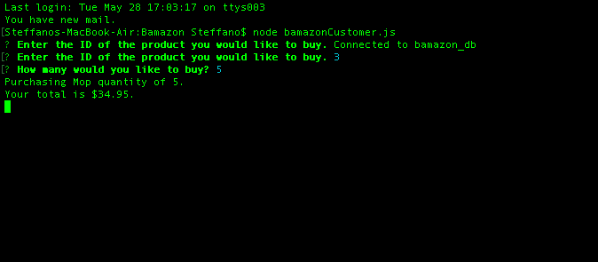
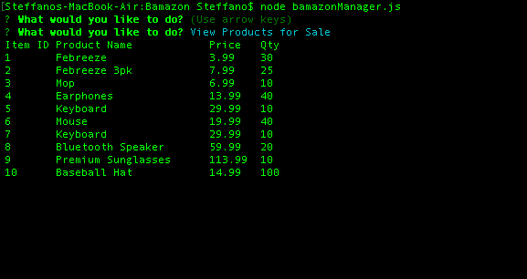
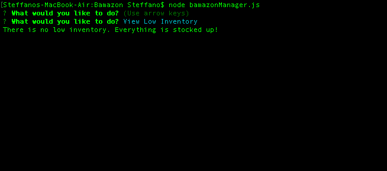
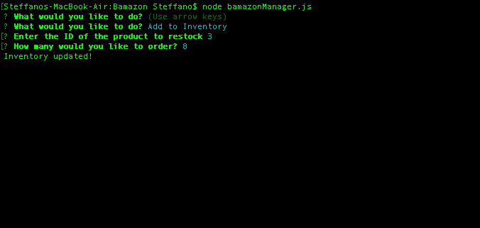
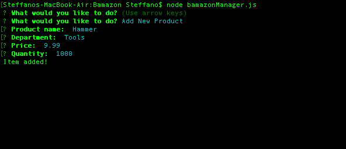
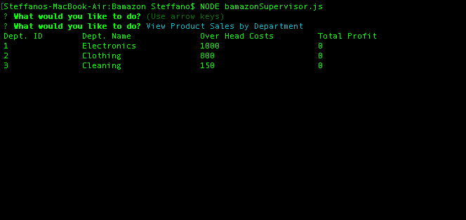
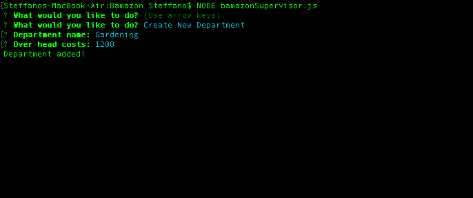

# Bamazon

## Description
An Amazon-like storefront CLI that takes in orders from customers and depletes stock from the store's inventory.

## Dependencies and APIs

  * [MySQL](https://www.npmjs.com/package/mysql)

  * [Inquirer](https://www.npmjs.com/package/inquirer)

## What Each Command Should Do

1. `node bamazonCustomer.js`

  * Run bamazon as a customer

    * The customer will be prompted two questions

    ```
        The ID of the item they would like to buy.
        The quantity of the item they would like to buy.
    ```

    * If there is enough in stock, they will be given the price needed to pay.



2. `node bamazonManager.js`

   * Run bamazon as a Manager

    * The Manager will be given 4 options:

      ```
      * View Products for Sale
      * View Low Inventory
      * Add to Inventory
      * Add New Product
      ```

    * Respectively, the following are images of each command.









3. `node bamazonSupervisor.js`

   * Run bamazon as a supervisor.

   * Supervisor will have two options.

     ```
     * View Product Sales by Department
     * Create New Department
     ```

    * Respectively, the following are images of each command.




